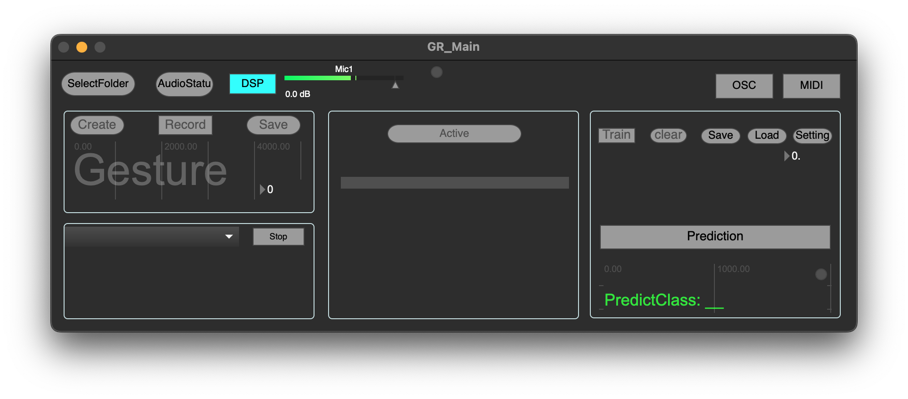

# PRiSM_MusicGestureRecognition
 
PRiSM Music Gesture Recognition is a software tool for creating musical gesture datasets and real-time recognition of musical gestures based on audio input. It utilizes machine learning techniques to classify and interpret musical gestures, enabling applications in interactive music performance, composition, and more.

**This software is in beta version and may contain bugs. Use with caution and at your own risk.**

-----------

## Features
1. Create and record multiple custom gesture samples. 
2. Train the ML model based on custom gesture recordings.
3. Running pre-trained models to real-time recognition of musical gestures based on audio input.
4. Output recognition result via OSC/MIDI.
5. Save/load the trained ML model and configuration.
6. Support for multiple input channels (Coming soon)

-----------

## Installation

1. Go to the GitHub release page of the PRiSM Music Gesture Recognition project.
2. Download the latest version of the software package for your operating system. (**Mac only currently**, if more people require the Windows version we can arrange it later.)
3. Copy the PRiSM Music Gesture Recognition app to your application folder.
4. Launch the PRiSM Music Gesture Recognition application.

-----------

## Usage

### Audio Setting
Click the `AudioStatu` button to open the [Audio Setting window](media/AudioSetting.png)

**Make sure to always use the same sampling rate for consistent results!**

### Create and record gesture samples
1. Click the `SelectFolder` button to choose a folder to store all the recordings.
2. Click the `Create` button to enter the name of the new gesture.
3. Use the `Record` button to start and stop recording the sample.
4. Click the `Save` button to save the recording to the selected folder.
5. Repeat steps 3 and 4 to record additional samples for the current gesture.

Note: You can use the `dropdown menu` to select a saved sample and the `Play` button to listen to it.

### Data Preparation

Click the `Activate` button to preprocess the data.

### Training 

1. After Data Preparation is finished, click the `Train` button to start the training process.
2. The area below will display the training loss. Wait for it to reach a satisfactory level (lower is generally better).
3. Click the `Train` button again to stop the training.
4. Click the `Prediction` button to enable real-time gesture recognition.
5. You can also use the `dropdown menu` and `Play` button to test the trained model with saved samples.
6. Click the `Save` button to save the trained model to disk.

### Fine-tuning

Click the `Setting` button to open the setting window where you can find adjustable parameters. 

### OSC setting

Click the `OSC` button to enable OSC output and open the [OSC setting window](media/OSC_Setting) to configure the OSC IP address and port.
By default, the recognition results are sent to `127.0.0.1:9001` with the message address `/PRiSM_GR`.

### MIDI setting

Click the `MIDI` button to enable MIDI output and open the [MIDI setting window](meida/MidiSetting) to configure the MIDI output.
The recognition results are automatically mapped to MIDI notes starting from MIDI note `60`. For example, the first gesture corresponds to MIDI note `60`, the second gesture to MIDI note `61`, and so on.

-----------

## Contributing

Contributions to the PRiSM Music Gesture Recognition project are welcome! If you encounter any issues or have ideas for improvements, please submit them as GitHub issues or create a pull request with your proposed changes.

-----------

## License

PRiSM Music Gesture Recognition is licensed under the [MIT License](LICENSE). You are free to use, modify, and distribute the software in accordance with the terms of the license.

-----------
