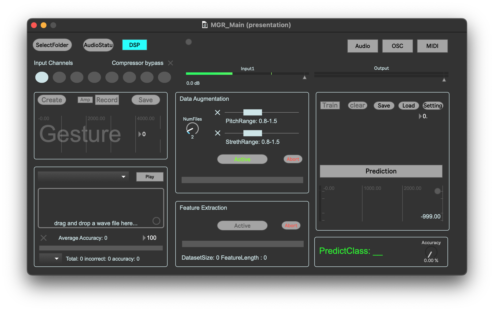

# PRiSM Music Gesture Recognition

PRiSM Music Gesture Recognition is a software tool for creating musical gesture datasets and real-time recognition of musical gestures based on audio input. It utilizes machine learning techniques to classify and interpret musical gestures, enabling applications in interactive music performance, composition, and more.

**⚠️ This software is in beta. It may contain bugs. Use with caution and at your own risk.**

-----------

## Table of Contents

- [Features](#features)
- [Installation](#installation)
- [Usage](#usage)
  - [Audio Setting](#audio-setting)
  - [Create and Record Gesture Samples](#create-and-record-gesture-samples)
  - [Data Augmentation](#data-augmentation)
  - [Data Preprocess](#data-preprocess)
  - [Training and Prediction](#training-and-prediction)
  - [Fine-tuning](#fine-tuning)
  - [Validation](#validation)
  - [OSC Setting](#osc-setting)
  - [MIDI Setting](#midi-setting)
  - [Gesture Audio Player](#gesture-audio-player)
- [Contributing](#contributing)
- [License](#license)
- [Credits](#credits)
- [References](#references)

-----------

## Features
- **Custom Gesture Samples**: Create and record custom gesture samples for personalized datasets.
- **Machine Learning Model Training**: Train a machine learning model with your own gesture recordings.
- **Real-Time Recognition**: Utilize pre-trained models for real-time gesture recognition from audio input.
- **OSC/MIDI Output**: Send recognition results through OSC or MIDI for further musical application.
- **Playback Mapping**: Map recognized gestures to audio playback for interactive experiences.
- **Persistence**: Save and load trained machine learning models and configurations for consistent performance.
- **Multi-Channel Support**: Accommodate multiple input channels for diverse audio setups.

-----------

## Installation

1. Visit the [GitHub release page](https://github.com/rncm-prism/PRiSM-MusicGestureRecognition/releases) for PRiSM Music Gesture Recognition.
2. Download the [latest software package](https://github.com/rncm-prism/PRiSM-MusicGestureRecognition/releases/download/v0.3/PRiSM_MGR_v0.3.zip) compatible with your system. (Currently available for **macOS** only.)
3. Unzip and move the application to your Applications folder.
4. Open PRiSM Music Gesture Recognition from your Applications.

   *Troubleshooting*: If you encounter a security warning, please refer to [Apple's guide on opening an app from an unidentified developer](https://support.apple.com/en-gb/guide/mac-help/mh40616/13.0/mac/13.0).

-----------

## Usage

### Audio Setting

- Press `AudioStatu` to configure your audio settings.
- Enable or disable input channels as required.
- Engage or bypass compression as needed.

*Important*: Consistent sampling rates are crucial for reliable results.

### Create and record gesture samples

1. Choose a directory for your recordings with `SelectFolder`.
2. Create a new gesture with `Create`. Ensure unique, simple names. \
   **Make sure the gesture name is unique and does not contain spaces and other special characters!**
3. Record samples with `Record`. Optionally, use `Amp` for automatic triggering.
4. Save your samples with `Save`.
5. Review and play samples using the dropdown menu and `Play`.

**Using your existing dataset**: If you choose a folder that already has the gesture sample files, ensure that the files in the folder follow the same naming convention. The naming convention is 'name-label-index'. The 'name' can be any preferred name, but by default, it is the folder name. The 'label' is the actual gesture name used for training and prediction purposes. The 'index' is not as crucial here and is mostly used for reference.

**Note: You can use the `dropdown menu` to select a saved sample and the `Play` button to listen to it.**

### Data Augmentation

Apply random pitch and time stretch to existing samples to generate new files and enhance the dataset.

1. Set the number of files to generate with `NumFiles`.
2. Enable and set random pitch range with `PitchRange`.
3. Enable and set random time streth range with `StrethRange`.
4. Click the `Activate` button to preprocess the data.

### Data Preprocess

Click the `Activate` button to preprocess the data. \
**Adjust `Spectrum Components` in the setting window for more detailed feature sets**

### Training and Prediction

1. Initiate training with `Train` and monitor the loss levels.
2. Stop training manually or let it auto-stop at a loss below 0.05.
3. Enable real-time recognition with `Prediction`.
4. Save your model with `Save` and load with `Load`.

### Fine-tuning

Click the `Setting` button to open the [setting window](media/Setting.png) where you can find adjustable parameters. \
**Some parameters can be controlled with OSC messages, the receive port is `1123`**

Parameter Name             |  Description   | Default Value  | Range        | OSC address
-------------              | -------------  | -------------  | -------------|-------------  |
On Threshold               |  Amplitude gate level, used to trigger listening.                                                          | -39dB | -60dB - 0dB | /OnThreshold       |
Off Threshold              |  Amplitude gate level, used to ending listening and trigger prediction.                                     | -59dB | -60dB - 0dB | /OffThreshold       |
Accuracy Threshold         | Filtering the predict result below the threshold.                                                                         | 0.    | 0. - 1.     | /AccuracyThreshold |
Timer                      |  The system reports after listening. If the timer is shorter than the default, it refreshes the buffer and forces a prediction. If longer than the default, it is disabled.         | Default is the longest duration in the training files but no more than 10 seconds.                                  | 50ms - 10000ms | /Timmer            |
Spectum Components         |  The number of frequency components in the spectrogram.                                                                   | f0, f1    | f0 - f7      | 🚫 |
Prediction                 |  Disable and enable prediction                                                                                            | 0     | 0 / 1     | /Prediction         |

### Validation

Test your model with the [Player & Validation](media/Player_Validation.png) module.
- Using the `dropdown menu` and `Play` button to test the trained model with saved samples.
- Set the number of validation and toggle to enable the automatic random validation. After the auto-validation is finished, it will display each gestuers' accuracy and `average accuracy`.

### OSC Setting

Click the `OSC` button to enable OSC output and open the [OSC setting window](media/OSC_Setting.png) to configure the OSC IP address and port.
By default, the recognition results are sent to `127.0.0.1:9001` with the message address `/PRiSM_GR`.

### MIDI Setting

Click the `MIDI` button to enable MIDI output and open the [MIDI setting window](media/MidiSetting.png) to configure the MIDI output, for instance, change the output MIDI Channel.
The recognition results are automatically mapped to MIDI notes starting from MIDI note `60`. For example, the first gesture corresponds to MIDI note `60`, the second gesture to MIDI note `61`, and so on.

### Gesture Audio player
Click the `Audio` button to enable gesture audio playback and open the [Gesture AudioPlayer window](media/AudioPlayer.png) to configure the Gestures-Audio mapping.

- After training is finished, the gesture-audio cells will spawn.
- Click the `SelectFolder` button to load the playback audio files folder.
- Using each cell to enable/disable and configure the mapping.

-----------

## Contributing

Contributions to the PRiSM Music Gesture Recognition project are welcome! If you encounter any issues or have ideas for improvements, please submit them as GitHub issues or create a pull request with your proposed changes.

-----------

## License

PRiSM Music Gesture Recognition is licensed under the [MIT License](LICENSE). You are free to use and distribute the software in accordance with the terms of the license. If you use this in your project kindly give credit to the RNCM PRiSM team. 

-----------

## Credits

This work is supported by [PRiSM](https://www.rncm.ac.uk/research/research-centres-rncm/prism/), The RNCM Centre for Practice & Research in Science & Music, funded by the Research England fund Expanding Excellence in England (E3). [About](media/About.png)

-----------

## References
- [flucoma-max](https://github.com/flucoma/flucoma-max) 
- [max-sdk](https://github.com/Cycling74/max-sdk)
